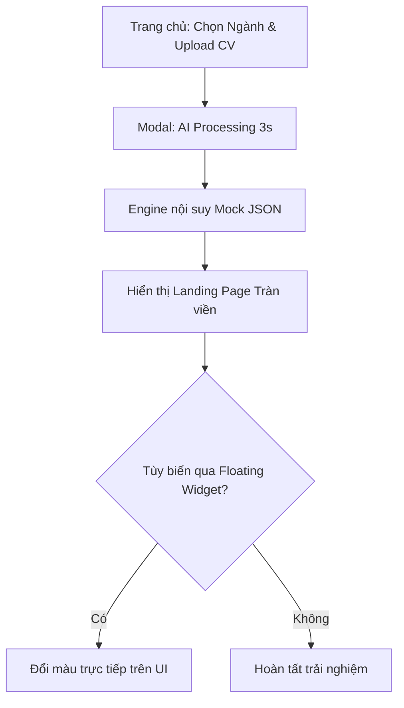

# TÀI LIỆU YÊU CẦU SẢN PHẨM (PRD)

# Gen-Folio — Hệ thống tạo Portfolio Landing Page 1 chạm

| Thông tin | Nội dung |
| --- | --- |
| Phiên bản | 3.0 — Cập nhật theo thể lệ Vibe Code Challenge |
| Trạng thái | Sẵn sàng nộp |
| Ngày | 25/09/2026 |
| Mục đích | Định hướng thiết kế, phát triển và nghiệm thu MVP cho cuộc thi Vibe Code Challenge |
| Nguồn | Xây dựng theo cấu trúc chuẩn từ PRD SpaFlow |
| Người phê duyệt | **[CẦN XÁC NHẬN]** Ban Giám Khảo Vibe Code |

> **Quy ước:** **[CẦN XÁC NHẬN]** là thông tin cần đội thi chốt trước khi tiến hành phát triển. **[ĐỀ XUẤT]** là giải pháp kỹ thuật ưu tiên để đáp ứng ràng buộc của cuộc thi. Phạm vi Must/Should/Could quyết định thứ tự ưu tiên triển khai.

## 1. Tóm tắt điều hành

Gen-Folio là hệ thống cho phép người dùng tự động khởi tạo một website Landing Page Portfolio hoàn chỉnh chỉ từ dữ liệu CV và lựa chọn ngành nghề. Hệ thống sử dụng Gemini AI để trích xuất thông tin từ CV thật, sau đó engine nội suy tự động ráp nối dữ liệu thành giao diện tràn viền (full-screen) sinh động. MVP tập trung vào ba kết quả: **thao tác đầu vào tối giản; tốc độ sinh giao diện tức thì; và kết quả đầu ra bám sát đặc thù ngành nghề (Tech/Creative/Business)**.

Sản phẩm hướng đến nhân sự nội bộ khối Kỹ thuật (Developer, DevOps, BA, UI/UX, Security) muốn xây dựng thương hiệu cá nhân. Hệ thống sử dụng dữ liệu trích xuất chính xác 100% từ CV thật qua Microsoft MarkItDown. Tuyệt đối không sử dụng thông tin bịa đặt (hallucinate). Khuyến khích các UI sáng tạo, màu sắc độc đáo và nói KHÔNG với các giao diện rập khuôn kiểu "AI slop".

## 2. Bối cảnh, bài toán và cơ hội

### 2.1. Hiện trạng — Ai đang gặp, gặp thế nào

Tôi và đồng nghiệp ở các phòng ban kỹ thuật, thiết kế và kinh doanh đều có chung một bài toán: **mỗi khi cần làm hồ sơ năng lực cá nhân trực tuyến** — để pitch với khách hàng, ứng tuyển vị trí mới trong nội bộ, hoặc xây dựng thương hiệu cá nhân — chúng tôi phải tự thiết kế qua Canva, kéo thả trên Wix/WordPress, hoặc lập trình thủ công.

- **Tần suất:** Trung bình mỗi quý 1 lần (khi có đợt review, thuyên chuyển, hoặc sự kiện kết nối). Riêng team Sales cần cập nhật khi có deal mới.
- **Thời gian tiêu tốn:** 4–6 giờ mỗi lần — kể cả khi đã có CV sẵn, vẫn phải tự điền lại từng ô dữ liệu vào nền tảng tạo web.
- **Kết quả hiện tại:** Không đồng nhất chất lượng. Trang web thường quá đơn giản, giao diện lỗi thời, code bằng HTML/CSS thô sơ hoặc quá mất thời gian chau chuốt. Khó khăn lớn nhất là các giao diện thường rất nhàm chán (chỉ dùng 1 màu) và giống hệt nhau (rập khuôn AI slop).
- **Ước lượng:** Khoảng 30–50 nhân sự ở các phòng ban có nhu cầu tương tự.

### 2.2. Tuyên bố vấn đề

> Nhân sự không chuyên thiết kế web cần một công cụ tự động chuyển hóa CV đã có sẵn thành một trang Landing Page chuyên nghiệp, tràn viền — mà không cần phải tự kéo thả, điền form hay cấu hình phức tạp nào. Chỉ cần upload CV và chọn ngành là xong.

### 2.3. Giá trị dự kiến

- **Giảm 95% thời gian:** Từ 4–6 giờ xuống còn dưới 30 giây để có một trang Landing Page chuyên nghiệp.
- **Không phụ thuộc kỹ năng thiết kế:** Mọi dữ liệu kinh nghiệm, kỹ năng tự động nằm đúng vị trí trong Layout chuẩn của ngành.
- **Trải nghiệm "Wow":** Hiệu ứng AI xử lý mượt mà tạo cảm giác sản phẩm thông minh và hiện đại.

## 3. Mục tiêu sản phẩm và thước đo

| Mã | Mục tiêu | Chỉ số và cách đo | Mức mục tiêu | Trạng thái |
| --- | --- | --- | --- | --- |
| G-01 | Giảm thiểu thao tác đầu vào | Số bước từ lúc bắt đầu đến khi ra kết quả | Tối đa 2 bước (Chọn ngành -> Bấm tạo) | Điều kiện bắt buộc |
| G-02 | Trải nghiệm sinh giao diện nhanh | Thời gian hiển thị màn hình chờ (Loading) | ≤ 3 giây (Mock processing) | Điều kiện thi đấu |
| G-03 | Đa dạng hóa hiển thị | Số lượng Theme UI cho dân Tech | Tối thiểu 3 Theme sáng tạo (Cyberpunk, Glassmorphism, Brutalist) | Bắt buộc |
| G-04 | Responsive Design | Giao diện tự động co giãn theo Viewport (Desktop/Mobile) | 100% không vỡ layout | Mục tiêu UI/UX |
| G-05 | Tùy biến nhanh | Thời gian cập nhật màu sắc qua Widget nổi | ≤ 100ms (Real-time) | Bắt buộc |

## 4. Người dùng mục tiêu và nhu cầu

| Nhóm | Nhu cầu | Tác vụ chính |
| --- | --- | --- |
| Nhân sự DevOps / System | Layout tập trung vào các luồng hạ tầng, kỹ năng quản trị server | Chọn ngành Tech, nạp CV DevOps |
| Nhân sự Software Developer | Layout hiển thị luồng code, dự án Git, technical stack | Chọn ngành Tech, nạp CV Dev |
| Nhân sự UI/UX & BA | Layout sáng tạo, hiển thị wireframe/flow rõ ràng, bắt mắt | Chọn ngành Tech, nạp CV UI/UX |
| Nhân sự Security | Layout bảo mật, hiển thị công cụ hacking/phòng thủ | Chọn ngành Tech, nạp CV Security |

## 5. Phạm vi sản phẩm

### 5.1. Ba chức năng chính (để chấm đạt/không đạt)

| # | Chức năng | Mô tả | Cách kiểm tra |
| --- | --- | --- | --- |
| **1** | **Upload CV & Tạo Portfolio tự động** | Người dùng chọn ngành nghề, upload CV (hoặc dùng Mock Data). Hệ thống dùng Gemini AI trích xuất dữ liệu và tự động tạo Landing Page phù hợp ngành. | Tải CV mẫu → ra kết quả Landing Page trong ≤ 30 giây. |
| **2** | **Hiển thị Landing Page full-screen theo ngành** | Kết quả là một trang web tràn viền, bố cục khác nhau cho từng ngành (Tech = Terminal/Darkmode, Creative = Glassmorphism, Business = Corporate). | Chọn 3 ngành → ra 3 layout khác nhau, full-screen, responsive. |
| **3** | **Floating Widget tùy biến real-time** | Nút nổi góc màn hình cho phép đổi màu chủ đạo, toggle Mobile/Desktop preview, chọn layout concept — tất cả cập nhật tức thì không reload. | Đổi màu → toàn trang cập nhật < 100ms, không F5. |

### 5.2. Phạm vi MVP bắt buộc (Must Have)

1. Màn hình trang chủ với form: Chọn ngành nghề và nút "Upload CV" (hỗ trợ PDF/DOCX hoặc fallback Mock Data).
2. Tích hợp Gemini AI (server-side) để trích xuất thông tin từ CV thật thành cấu trúc JSON.
3. Màn hình chờ (Loading) hiển thị tiến trình phân tích CV với hiệu ứng mượt mà.
4. Cơ chế mapping (ánh xạ) dữ liệu JSON vào các khối React Components tương ứng theo ngành.
5. Màn hình Kết quả: Landing Page hiển thị toàn màn hình (Full-screen), không bị bó hẹp trong khung Preview.
6. Floating Widget (Nút nổi góc màn hình) để người dùng tinh chỉnh nhanh màu sắc chủ đạo.
7. Tính năng Chia sẻ tạm thời (Temporary Share Link) — tạo link portfolio có thời hạn, lưu vào CSDL.

### 5.3. Phạm vi ưu tiên tiếp theo

| Mức | Nhóm tính năng | Điều kiện đưa vào bản thi |
| --- | --- | --- |
| Should | Nút toggle (Desktop/Mobile) trên Floating Widget | Để giám khảo dễ dàng test tính năng Responsive trên cùng một màn hình |
| Should | Chọn layout concept (Terminal, Magazine, Glassmorphism, ...) | Tăng đa dạng hiển thị cho từng ngành |
| Could | Xuất file JSON cấu hình để người dùng tải về | Chỉ thực hiện sau khi luồng cốt lõi ổn định |

### 5.4. Ngoài phạm vi MVP

Hệ thống đăng nhập/phân quyền, gắn tên miền riêng (Custom Domain), chỉnh sửa nội dung trực tiếp trên Landing Page (inline editing), và tính năng xuất mã nguồn tĩnh.

### 5.5. Giả định và ràng buộc

- Toàn bộ dữ liệu trong sản phẩm là **dữ liệu giả** do đội thi tự tạo. Không chứa thông tin nhạy cảm hay dữ liệu thật của công ty.
- Thời gian xây dựng MVP bị giới hạn bởi cuộc thi; nền tảng triển khai bắt buộc là **Vibe Host của Mắt Bão** (vibehost.matbao.ai).
- Mã nguồn được lưu trên **GitHub Private repo**, thêm `git@matbao.ai` làm collaborator quyền chỉ đọc để ban giám khảo review.
- Stack kỹ thuật: **Vite + React + Tailwind CSS** (Frontend), **Express + TypeScript** (Backend/API), **Gemini AI** (trích xuất CV).
- Tài khoản AI dùng để làm bài là tài khoản cá nhân, không dùng colab.matbao.ai.

## 6. Luồng người dùng

### 6.1. Khởi tạo Portfolio tự động

1. Khách truy cập trang chủ, chọn ngành nghề mục tiêu từ Dropdown (ví dụ: Tech).
2. Bấm nút "Tải CV & Tạo Web" (Hệ thống ngầm gọi file Mock JSON tương ứng).
3. Hệ thống chuyển sang màn hình Modal "AI đang phân tích..." với hiệu ứng Loading trong 2-3 giây.
4. Chuyển thẳng sang trang Portfolio Landing Page tràn viền (Full-screen) với dữ liệu đã được điền tự động vào đúng giao diện ngành Tech.
5. Người dùng bấm vào Nút nổi (Floating Widget) góc phải dưới màn hình, chọn đổi tông màu, giao diện cập nhật tức thì.

## 7. Yêu cầu chức năng chi tiết

| ID | Ưu tiên | Yêu cầu có thể kiểm thử |
| --- | --- | --- |
| FR-01 | Must | Form đầu vào cho phép chọn 1 trong 3 nhóm ngành và gọi hàm tải mock data thành công. |
| FR-02 | Must | Render Engine tự động xác định và tải đúng bộ Layout Component dựa trên biến `industry` từ JSON. |
| FR-03 | Must | Màn hình kết quả (Output) phải hiển thị full-screen, cuộn trang độc lập, không có Sidebar. |
| FR-04 | Must | Floating Widget chứa bảng chọn màu (Color Picker). Khi chọn màu mới, các màu nhấn (Primary) trên toàn trang đổi ngay lập tức. |
| FR-05 | Should | Nút gạt Mobile/Desktop trên Widget. Khi kích hoạt Mobile, vùng chứa website tự động thu hẹp về kích thước 375px (căn giữa màn hình). |

### 7.1. Ma trận quyền nghiệp vụ

Dự án Gen-Folio MVP là một luồng cá nhân hóa 1 chiều (Single-player experience), không yêu cầu phân quyền đăng nhập phức tạp. Mọi người dùng truy cập đều có quyền trải nghiệm toàn bộ luồng tạo và tùy biến. **[ĐỀ XUẤT]** Bỏ qua hệ thống User Auth để tập trung 100% thời gian cho UI/UX.

## 8. Quy tắc nghiệp vụ

| ID | Quy tắc |
| --- | --- |
| BR-01 | Ngành `tech` bắt buộc mapping với Theme Darkmode, font chữ monospace. |
| BR-02 | Ngành `creative` bắt buộc mapping với Theme Glassmorphism, font chữ sans-serif. |
| BR-03 | Ngành `business` bắt buộc mapping với Theme Corporate, font chữ serif truyền thống. |
| BR-04 | Mọi sự thay đổi tùy chỉnh trên Floating Widget chỉ được lưu cục bộ trong React State (sẽ mất đi khi người dùng tải lại trang F5). |

## 9. Dữ liệu và tích hợp

### 9.1. Thực thể nghiệp vụ

| Thực thể | Thuộc tính cốt lõi | Vai trò trong sản phẩm |
| --- | --- | --- |
| **Profile** | `id`, `industry`, `fullName`, `title`, `bio`, `email`, `phone`, `location`, `socials`, `skills[]`, `experiences[]`, `projects[]`, `education[]`, `testimonials[]`, `metrics[]`, `certifications[]`, `awards[]` | Dữ liệu hồ sơ đầy đủ của người dùng — được trích xuất từ CV bằng Gemini AI hoặc nạp từ Mock Data. Phải chuẩn bị sẵn 3 bộ Mock Profile cho 3 ngành. |
| **ThemeConfig** | `active_concept`, `primary_color`, `font_family`, `viewport_mode` | Trạng thái hiển thị hiện tại, bị tác động trực tiếp bởi Floating Widget. |
| **SharedPortfolio** | `id`, `profile` (JSON), `concept`, `primaryColor`, `createdAt`, `expiresAt`, `expiresInHours` | Lưu trữ các portfolio được chia sẻ tạm thời qua link. Tự động xóa sau khi hết hạn. |

### 9.2. Cơ sở dữ liệu

- **Lưu trữ:** Sử dụng file-based JSON store (đường dẫn `/tmp/genfolio_shares.json`) cho MVP. Khi triển khai lên Vibe Host, có thể nâng cấp lên PostgreSQL (Vibe Host cung cấp sẵn 1 suất DB miễn phí).
- **Dữ liệu giả:** Toàn bộ dữ liệu trong CSDL là dữ liệu giả do đội thi tự tạo. Không chứa thông tin thật của nhân sự.
- **Tự động dọn dẹp:** Shared portfolios hết hạn được xóa tự động mỗi 15 phút.

### 9.3. Tích hợp bên ngoài

- **AI/LLM (Gemini AI):** Sử dụng Google Gemini API (model `gemini-3.8-flash`) trên server-side để trích xuất thông tin từ file CV (PDF/DOCX). Có cơ chế fallback qua `gemini-3.1-flash-lite` khi model chính quá tải.
- **Microsoft MarkItDown:** Tiền xử lý file CV thành Markdown trước khi gửi cho Gemini, tăng độ chính xác trích xuất.
- **Fallback Mock Data:** Khi không có Gemini API key hoặc gặp lỗi, hệ thống tự động dùng Mock Data để demo không bị gián đoạn.

## 10. Danh sách màn hình và định hướng UX

| Khu vực | Màn hình tối thiểu | Nội dung chính |
| --- | --- | --- |
| Input | Trang chủ (Hero Section) | Giao diện tối giản. Trung tâm màn hình là Form Dropdown chọn ngành và Button tải CV. Hiệu ứng Background Blur/Glass tinh tế. |
| Loading | Modal Overlay | Biểu tượng quét dữ liệu, text thay đổi liên tục mô phỏng AI ("Đang đọc kỹ năng...", "Đang lên bố cục..."). |
| Output | Landing Page hoàn chỉnh | Trang trình bày nội dung tràn viền. Bố trí Floating Widget (icon bánh răng) cố định ở góc phải dưới (`fixed bottom-4 right-4`). |

## 11. Yêu cầu phi chức năng

| ID | Nhóm | Yêu cầu | Điều kiện cần chốt |
| --- | --- | --- | --- |
| NFR-01 | Hiệu năng | Thao tác đổi màu qua Widget phải mượt (< 100ms), không gây hiện tượng re-render giật lag toàn trang. | Sử dụng CSS Variables để tối ưu việc đổi màu. |
| NFR-02 | Responsive | 100% Component trên Landing Page (Hero, Grid, Timeline) không được tràn ngang hoặc vỡ khung trên màn hình điện thoại. | Kiểm thử kỹ với chế độ Mobile của Chrome DevTools. |
| NFR-03 | Triển khai | Sản phẩm phải triển khai và chạy được trên Vibe Host (vibehost.matbao.ai) với đường dẫn công khai. | Stack: Vite (build) + Express (server), kết nối GitHub repo. |
| NFR-04 | Bảo mật | Mã nguồn không chứa thông tin nhạy cảm. GitHub repo đặt Private, chỉ thêm `git@matbao.ai` read-only. | Kiểm tra trước khi push lên GitHub. |

## 12. Tiêu chí nghiệm thu

### 12.1. Điều kiện bắt buộc của MVP

| ID | Tình huống | Kết quả đạt |
| --- | --- | --- |
| AC-01 | Tại trang chủ, người dùng chọn ngành "Tech" và bấm tạo. | Hệ thống hiển thị màn hình chờ (3s), sau đó chuyển hướng thẳng tới Landing Page với layout dành riêng cho Developer. |
| AC-02 | Kiểm tra layout màn hình kết quả (Output). | Website hiển thị Full-screen (tràn viền 100% width), nội dung bám sát mock data, không dính lỗi hiển thị Sidebar thừa. |
| AC-03 | Mở Floating Widget, bấm đổi sang màu Cam. | Nút bấm, viền card, và các icon trên toàn trang lập tức chuyển sang màu Cam mà không bị tải lại trang. |

### 12.2. Chỉ nghiệm thu nếu tính năng Should/Could được chọn

| ID | Tính năng | Kết quả đạt |
| --- | --- | --- |
| AC-S01 | Toggle Mobile/Desktop | Bấm nút chuyển sang Mobile trên Widget, vùng hiển thị web bị giới hạn chiều rộng mô phỏng chính xác màn hình điện thoại. |

### 12.3. Definition of Done cho bản demo

Chuẩn bị sẵn tối thiểu **3 file JSON Mock Profile khác nhau** tương ứng 3 ngành nghề. Luồng Loading mượt mà, render tràn viền, Widget đổi màu hoạt động hoàn hảo, giao diện responsive 100%. Demo có thể chạy khép kín từ đầu đến cuối trước ban giám khảo mà không cần can thiệp F5 hay sửa dữ liệu thủ công.

## 13. Rủi ro và phụ thuộc

| Rủi ro/phụ thuộc | Hậu quả | Hướng xử lý |
| --- | --- | --- |
| Xung đột CSS giữa các Theme ngành nghề | Giao diện ngành Tech bị nhận nhầm style/màu nền của ngành Creative | Áp dụng tính năng CSS Modules hoặc các class tiền tố (prefix) của Tailwind riêng biệt cho từng Theme. |
| Gemini API key hết hạn hoặc bị rate limit | Người dùng không thể trích xuất CV | Cơ chế fallback: thử 3 model khác nhau (`gemini-3.8-flash` → `gemini-3.1-flash-lite` → `gemini-flash-latest`), cuối cùng dùng Mock Data. |
| Vibe Host cần cấu hình đặc biệt cho Express server | Lỗi 500 khi deploy | Sử dụng Vite build cho frontend static + Express server riêng, kiểm tra tương thích Vibe Host trước hạn nộp. |
| Mã nguồn vô tình chứa thông tin nhạy cảm | Vi phạm bảo mật cuộc thi | Dùng `.env` cho API key, `.gitignore` loại bỏ file nhạy cảm, kiểm tra trước khi push lên GitHub. |

## 14. Câu hỏi cần xác nhận và quyết định sản phẩm

| Mã | Ưu tiên | Quyết định cần chốt | Bên chốt đề xuất |
| --- | --- | --- | --- |
| Q-01 | P0 | Cấu trúc chuẩn xác của các trường JSON Mock Data (Skill, Project, Exp) sẽ bao gồm những gì để cover được cả 3 ngành? | Kỹ thuật / Đội thi |
| Q-02 | P0 | Bảng màu (Palette) hiển thị trên Floating Widget sẽ cung cấp bao nhiêu màu tùy chọn? | Đội thiết kế / Kỹ thuật |

## 15. Kịch bản trình diễn tham chiếu

Giám khảo đóng vai nhân sự phòng Kỹ thuật (Developer) cần làm trang cá nhân. Tại giao diện trang chủ cực kỳ tối giản, giám khảo chọn ngành "Tech" và upload một file CV mẫu (PDF). Hệ thống hiển thị màn hình Modal với hiệu ứng AI đang trích xuất kỹ năng, kinh nghiệm, dự án từ CV.

Sau khoảng 10–20 giây xử lý, một website mang phong cách Terminal/Darkmode hiện đại hiện ra toàn màn hình — hiển thị rõ tên, kỹ năng (React, TypeScript, Docker) và các dự án tiêu biểu được trích xuất từ CV. Giám khảo bấm vào Floating Widget ở góc dưới bên phải, đổi sang màu Xanh lá — toàn bộ điểm nhấn trên trang web lập tức cập nhật. Tiếp tục bấm "Share" để tạo link chia sẻ tạm thời, gửi cho đồng nghiệp xem.

Toàn bộ quá trình từ upload CV đến có một trang Landing Page chuyên nghiệp chỉ mất dưới 30 giây và 2 thao tác click.

## 16. Yêu cầu triển khai và nộp bài

| Hạng mục | Yêu cầu |
| --- | --- |
| Nền tảng triển khai | Vibe Host (vibehost.matbao.ai), đăng ký bằng email @matbao.com |
| Mã nguồn | GitHub Private repo, thêm `git@matbao.ai` làm collaborator (read-only) |
| Dữ liệu | 100% dữ liệu giả, không chứa thông tin thật của công ty |
| Công cụ AI | Tài khoản cá nhân (Google One AI Pro / Claude / ChatGPT), không dùng colab.matbao.ai |
| PRD | File .md, tối thiểu 200 ký tự |

---
**Điều kiện đưa PRD sang trạng thái Approved:** Đội thiết kế, kỹ thuật và QA thống nhất cách thể hiện, luồng dữ liệu và kiểm thử; mọi thay đổi về mức ưu tiên (Must/Should) được cập nhật vào bảng phạm vi trước khi giao cho công cụ AI tiến hành Vibe Coding.